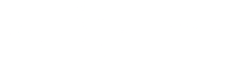

# Fourier Transform
An interesting algorithm which converts samples into complex coefficients, and 
vice versa. One of the applications of this would be to decompose a signal, such as 
audio, into its frequencies, allowing for signal processing, such as sound editing.

The base form is

<!-- (\hat{f}(t) = \int_{-\infty}^{\infty}f(x)e^{-2\pi ixt}dx)-->

However, this can't be computed with ease, and is useless if one doesn't have a function,
which is frequently the case if one wants to analyze real world data. This necessity
called for the creation of the DFT, the Discrete Fourier Transform:

<!--F(k) = \sum_{j=0}^{N-1} f_k e^{-2\pi ijk/N}-->

This isn't great in terms of the time complexity to transform a whole data set, O(N^2)
In this project I've decided to go with the standard implementation of the FFT,
Fast Fourier Transform, algorithm: The Cooley-Tukey Radix 2 FFT, 
which has a time complexity of O(N log(N)). It is a recursive algorithm,
which at each recursion splits the data into its even and odd indexed inputs, and
computes the DFT on those. This obviously means that the size of the data set has to be a power of 2, but it is
sufficient to pad the data with zeroes up to the next power.

# Resources

[Fourier Transform Explanation by 3blue1brown](https://www.youtube.com/watch?v=spUNpyF58BY)

[Discrete Fourier Transform by Steve Brunton](https://www.youtube.com/watch?v=nl9TZanwbBk)

[Fast Fourier Transform by MIT w/ Erik Demaine](https://www.youtube.com/watch?v=iTMn0Kt18tg)

[In depth and rigorous explanation of all the above + prerequisites (complex numbers, Euler's identity)](https://ccrma.stanford.edu/~jos/st/)